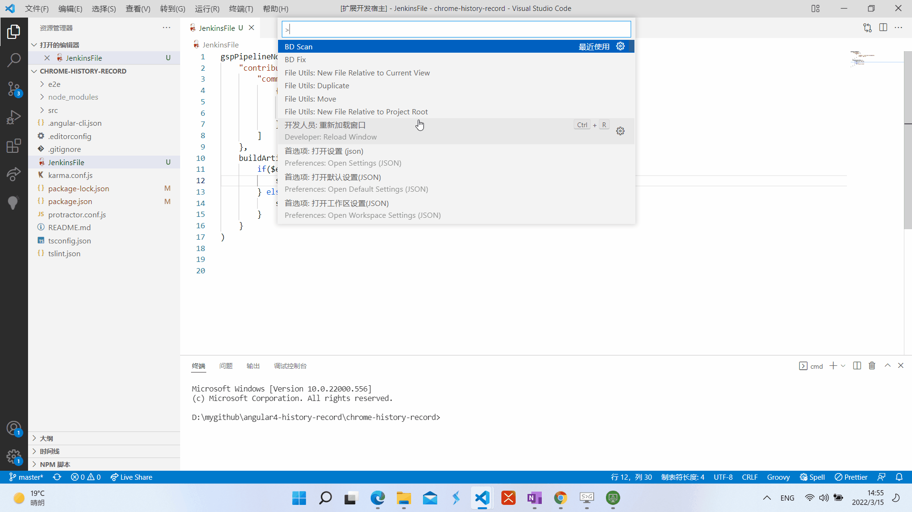

<<<<<<< HEAD
# first extension

Use the extension to scan and fix front-end app. **make sure!!! Workspace exist jenkins file**

# How to use


## Using the command palette:

- BD fix
  
  This command is used to fix BD issue when app build in ECS. Update Jenkins file and new a remove-devDependencies file.
  ```sh
    buildArtifactsFunc: {
		....
        sh ''' chmod 777 ./script/remove-devDependencies.js
        node ./script/remove-devDependencies.js'''
        
    }
  ```

- BD scan
  
  This command is used to scan dependencies BD issue, if found, Need to fix it manually because dependencies package will defect app.


# License

MIT
=======

>>>>>>> b001781f1613cd9162350270dcd4142f61dbca84
